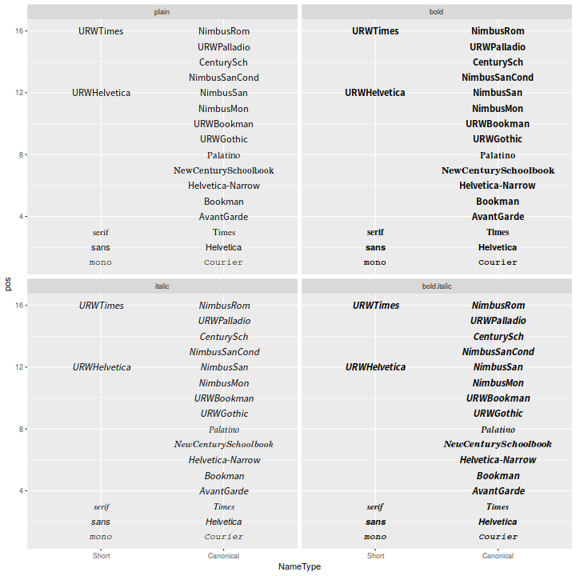
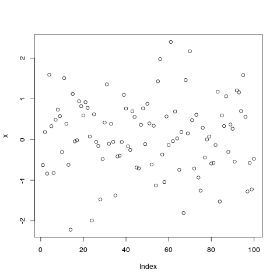
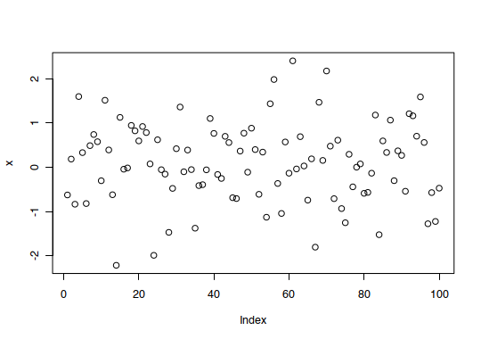

# 图形混杂

```{r, include=F}
knitr::opts_chunk$set(
  collapse = TRUE,
  comment = "#>"
)
```

## 输出到文件 PDF-PNG-TIFF-SVG

### 问题

你想将图形保存到文件。

### 方案

R 中有好几种命令可以直接将图形导出为文件而不是打印到屏幕上。另外，你必须通过 `dev.off()` 命令告诉 R 你已经完成作图了，否则你的图形是不会显示出来的。

#### PDF格式

PDF 是一种矢量文件格式。一般我们都更倾向于将图形输出为矢量图文件，因为这样的图无论怎样缩放都不会出现像素点。矢量图文件的大小通常要比位图文件要小，除非该文件里包含了过多的内容（比如说一张散点图内包含了上千个点，这时候就会造成矢量图大而位图小）。

```{r, eval=FALSE}
pdf("plots.pdf")
dev.off()
```

PDF 默认是 7x7 英寸，并且每个图形都单独占一页。这个尺寸是可以更改的：

```{r, eval=FALSE}
# 6x3 英寸
pdf("plots.pdf", width=6, height=3)
# 10x6 厘米
pdf("plots.pdf", width=10/2.54, height=6/2.54)
```

如果你想在 Inkscape 或者 Illustrator 这样的矢量图编辑器中修改你的文件，图形中的一些绘制点有可能看上去更像是字母而并非原来的圆形或方形等。为了防止这种情况的发生可以输入：

```{r, eval=FALSE}
pdf("plots.pdf", useDingbats=FALSE)
```

#### SVG 格式

SVG 是另一种矢量图。默认的  `svg()` 命令无法将多页图形输出到一个文件中，因为大部分的 SVG 浏览软件无法处理多页的 SVG 文件。后面的 PNG 内容中将涉及如何输出到多个文件。

```{r, eval=FALSE}
svg("plots.svg")
dev.off()
```

SVG 文件比 PDF 文件更适合矢量图编辑器。

#### PNG/TIFF格式

PNG 和 TIFF 是位图（栅格图像），对它们进行缩放时可能会出现像素点。

```{r, eval=FALSE}
png("plot.png")
# 或者 tiff("plot.tiff")
dev.off()
```

输出的图像默认尺寸为 480x480 像素，分辨率为 72dpi （即 6.66x6.66 英寸）

当分辨率增加时文本与图像元素的大小也会（以像素为单位）增加。这是因为这些元素的大小只与图像的物理大小有关（比如 4x4 英寸），而与图像的像素大小无关。例如，一个 12 磅的字符高度为 12/72 = 1/6 英寸，在分辨率为 72dpi 的情况下，它共包含 12 个像素点；而在分辨率放大到 120dpi 时，它就含有 20 个像素点了。

以下创建一个大小为 480x240 像素，分辨率为 120dpi 的图像,其实际大小相当于 4x2 英寸。

```{r, eval=FALSE}
png("plot.png", width=480, height=240, res=120)
dev.off()
```

如果你要创建不止一张图像，必须对每张图像执行一个新的 `png()` 命令，或者将 `%d` 放置到文件名中:

```{r, eval=FALSE}
png("plot-%d.png")
dev.off()
```
上述代码会生成 plot-1.png, plot-2.png 等系列文件。

#### 对于不支持 PDF 格式的程序 （MS Office）

有些不支持 PDF 文件导入的程序一般都需要高分辨率的 PNG 或 TIFF 文件。比如说微软 Office 无法导入 PDF 格式文件。而对于印刷出版物，则需要使用 300dpi 的图像。

```{r, eval=FALSE}
# 绘制一幅 6x6 英寸，300dpi 的图像
ppi <- 300
png("plot.png", width=6*ppi, height=6*ppi, res=ppi)
plot(...)
dev.off()
```

#### ggplot2

如果你在脚本或函数中使用 `ggplot2` 进行绘图，必须使用 `print()` 命令确保图像得到渲染。

```{r, eval=FALSE}
# 无效命令
pdf("plots.pdf")
qplot(...)
dev.off()
# 正确的做法
pdf("plots.pdf")
print(qplot(...))
dev.off()
```

从屏幕中保存一个 ggplot2 图像为文件，你可以使用 `ggsave()`。

```{r, eval=FALSE}
ggsave("plot.pdf")
ggsave("plot.pdf", width=4, height=4)
# 将图形保存为 400x400，100 ppi的文件
ggsave("plot.png", width=4, height=4, dpi=100)
```

#### 保存屏幕中的图像

如果你的屏幕中已经有一张图像了，可以将其保存为位图。

这是一种将屏幕中的对象作出从像素到像素的拷贝，不过这种操作很大概率只能在 Linux 和 Mac 的 X11 系统下得以实现：

```{r, eval=FALSE}
# 在屏幕中绘制一张图形
plot(...)
savePlot("myplot.png")
```

这一步是保存屏幕当前图像，并且根据不同的设备对图像进行重新渲染，图像大小可能会因此发生变化。如果你需要图形大小固定，则需要以像素为单位对尺寸进行指定。

```{r, eval=FALSE}
# 在屏幕中绘制图像
plot(...)
dev.copy(pdf,"myplot.pdf", width=4, height=4)
dev.off()
# 等同于：
# pdf("myplot.pdf", width=4, height=4)
# plot(...)
# dev.off()
dev.copy(png,"myplot.png", width=400, height=400)
dev.off()
```

## 形状和线形 {#shape-and-linetype}

### 问题

你想在图形中使用不同的形状和线条。

### 方案

```{r, fig.cap="R支持的符号", fig.align="center", include=FALSE}
knitr::include_graphics("http://www.cookbook-r.com/Graphs/Shapes_and_line_types/figure/unnamed-chunk-2-1.png")
```

```{r, fig.cap="R支持的线型", fig.align="center", include=FALSE}
knitr::include_graphics("http://www.cookbook-r.com/Graphs/Shapes_and_line_types/figure/line_types-1.png")
```


在输出位图时，对符号 15-18 的渲染可能不具抗锯齿性，即无论这些图形的绘制是否来自同一个平台，这些符号都有可能会被拉伸变形，出现像素点，或者无法居中。符号 19 和 21-25 在填充部分外周会有边框线，在大部分情况下这种边线在渲染时其边缘都是平滑的。另外，要使符号 21-25 显示实心填充，需要指定与边线颜色 (`col`) 一致的填充 (`bg`) 颜色，否则这些符号将会是空心的。

#### 标准图形

通过 `pch` 选项来设置符号形状, 并且通过 `lty` 和 `lwd` 来设定线条的类型和粗细。线条的类型可以通过名字或数字来指定。

```{r}
set.seed(331)

# 绘制一些点线
# 设定绘画范围
par(mar=c(3,3,2,2))
plot(NA, xlim=c(1,4), ylim=c(0,1))
# 绘制实心圆和实线
points(1:4, runif(4), type="b", pch=19)
# 添加空心方框和粗虚线
points(1:4, runif(4), type="b", pch=0,  lty=2, lwd=3)
points(1:4, runif(4), type="b", pch=23,   # 菱形符号
       lty="dotted", cex=2,               # 点状线, 符号形状放大一倍
       col="#000099", bg="#FF6666")       # 线条蓝色，符号形状红色填充
```


#### ggplot2

在调用 ggplot2 的情况下，可以对图中的符号形状和线条类型进行全局的部署（比方说你想让所有数据点都是方形，所有的线条都为虚线），或者通过一个变量来调整它们。

```{r}
# 示例数据
df <- read.table(header=T, text='
  cond xval yval
     A    1  2.0
     A    2  2.5
     B    1  3.0
     B    2  2.0
')

library(ggplot2)

# 使用标准的线条和符号形状作图
# 用 group = cond 表示点线之间的对应关系
ggplot(df, aes(x=xval, y=yval, group = cond)) +
    geom_line() +
    geom_point()
# 设置全局的符号形状和线条类型
ggplot(df, aes(x=xval, y=yval, group = cond)) +
    geom_line(linetype="dashed",  # 虚线
              size = 1.5) +       # 加粗
    geom_point(shape = 0,         # 空心方块
               size = 4)          # 放大形状
# 通过变量 cond 调整符号图形和线类型
ggplot(df, aes(x=xval, y=yval, group = cond)) +
    geom_line(aes(linetype=cond), # cond 决定线条类型
              size = 1.5) +       # 线条加粗
    geom_point(aes(shape=cond),   # cond 决定形状
               size = 4)          # 放大形状
# 在上述的基础上同时改变所使用的线条和形状
ggplot(df, aes(x=xval, y=yval, group = cond)) +
    geom_line(aes(linetype=cond), # cond 决定线条类型
              size = 1.5) +       # 线条加粗
    geom_point(aes(shape=cond),   # cond 决定形状
               size = 4) +        # 放大形状
    scale_shape_manual(values=c(6,5)) +                  # 更改形状
    scale_linetype_manual(values=c("dotdash", "dotted")) # 更改线条类型
```

一般来说 ggplot2 使用的是实心形状。如果你想要空心的形状又不想手动地对每个形状进行定义，可以使用 `scale_shape(solid=FALSE)`。注意，这个时候形状空心部分中的线条是可见的。为了避免这种情况，你可以使用符号形状 21-25 并且指定白色填充。

```{r}
# 空心形状
ggplot(df, aes(x=xval, y=yval, group = cond)) +
    geom_line(aes(linetype=cond), # cond 决定线条类型
              size = 1.5) +       # 线条加粗
    geom_point(aes(shape=cond),   # cond 决定符号形状
               size = 4)  +       # 放大形状
    scale_shape(solid=FALSE)

# 白色填充形状
ggplot(df, aes(x=xval, y=yval, group = cond)) +
    geom_line(aes(linetype=cond), # cond 决定线条类型
              size = 1.5) +       # 线条加粗
    geom_point(aes(shape=cond),   # cond 决定符号形状
               fill = "white",    # 白色填充
               size = 4)  +       # 放大形状
    scale_shape_manual(values=c(21,24))  # 形状：实心圆和三角形
```

#### 附录

以下代码会生成本章节开头所示的图表。

```{r}
par(mar=c(0,0,0,0))

# 设定绘图区域
plot(NA, xlim=c(0,1), ylim=c(6.5, -0.5),
    xaxt="n", yaxt="n",
    xlab=NA, ylab=NA )

# 画线条
for (i in 0:6) {
    points(c(0.25,1), c(i,i), lty=i, lwd=2, type="l")
}
# 添加标签
text(0, 0, "0. 'blank'"   ,  adj=c(0,.5))
text(0, 1, "1. 'solid'"   ,  adj=c(0,.5))
text(0, 2, "2. 'dashed'"  ,  adj=c(0,.5))
text(0, 3, "3. 'dotted'"  ,  adj=c(0,.5))
text(0, 4, "4. 'dotdash'" ,  adj=c(0,.5))
text(0, 5, "5. 'longdash'",  adj=c(0,.5))
text(0, 6, "6. 'twodash'" ,  adj=c(0,.5))
```

## 字体

### 问题

你想在图像中使用不同的字体。

### 方案

更新: 查看 [**extrafont**](https://github.com/wch/extrafont) 包相关内容，该包能更好地支持 PDF 和 Windows 位图中的字体设定。 

R 在一般情况下都不能很好地支持字体的显示。在不同的操作系统和不同的输出格式中都会出现不一样的结果。

#### geom_text

通过 ggplot2 中的 `geom_text` or `annotate` , 你可以对图形文本中的一系列属性进行设置。 `geom_text` 用于将数据框中的文本加入到图表中，而 `annotate` 则用于往图表中添加单个文本元素。

Name | Default value
:---|:---
`size` | 5
`family` |`""` (sans)
`fontface` | `plain`
`lineheight` |	1.2
`angle` |	0
`hjust` |	0.5
`vjust` |	0.5

注意这里 `size` 的单位是毫米, 而非磅。

```{r}
dat <- data.frame(
    y = 1:3,
    text = c("This is text", "Text with\nmultiple lines", "Some more text")
)

library(ggplot2)
p <- ggplot(dat, aes(x=1, y=y)) + 
       scale_y_continuous(limits=c(0.5, 3.5), breaks=NULL) +
       scale_x_continuous(breaks=NULL)

p + geom_text(aes(label=text))
p + geom_text(aes(label=text), family="Times", fontface="italic", lineheight=.8) +
    annotate(geom="text", x=1, y=1.5, label="Annotation text", colour="red",
             size=7, family="Courier", fontface="bold", angle=30)
```


#### themes and element_text

在管理类似标题，图注，坐标轴标签等元素时，可以使用 `element_text`, 其参数设置跟 `geom_text` 基本一致, 除了  `size` 的单位是 **points** (而非 mm), 还有就是它用的是 `face` 而不是 `fontface` 。默认情况下，`size` 取决于元素，比如图形标题的字体总是比刻度标签的大。

```{r}
p + geom_point() +
    ggtitle("This is a Title") +
    theme(plot.title=element_text(family="Times", face="bold", size=20))
```


#### 字体表格

你可以运行下列代码来生成一张不同字体的图形表。 每种字体都有**简称**和**字体标准家族名称**，定义字体时使用其中一种即可。

```{r}
fonttable <- read.table(header=TRUE, sep=",", stringsAsFactors=FALSE,
                        text='
Short,Canonical
mono,Courier
sans,Helvetica
serif,Times
,AvantGarde
,Bookman
,Helvetica-Narrow
,NewCenturySchoolbook
,Palatino
,URWGothic
,URWBookman
,NimbusMon
URWHelvetica,NimbusSan
,NimbusSanCond
,CenturySch
,URWPalladio
URWTimes,NimbusRom
')

fonttable$pos <- 1:nrow(fonttable)

library(reshape2)
fonttable <- melt(fonttable, id.vars="pos", measure.vars=c("Short","Canonical"),
                  variable.name="NameType", value.name="Font")

# 创建一个分面形式的图表。确保因子的顺序是正确的
facetable <- data.frame(Face = factor(c("plain","bold","italic","bold.italic"),
                                      levels = c("plain","bold","italic","bold.italic")))

fullfonts <- merge(fonttable, facetable)

library(ggplot2)
pf <- ggplot(fullfonts, aes(x=NameType, y=pos)) + 
             geom_text(aes(label=Font, family=Font, fontface=Face)) +
             facet_wrap(~ Face, ncol=2)
```

在屏幕中查看:

```{r  message=FALSE, warning=FALSE}
pf
```

你在屏幕中所看见的不一定跟你输出为 PNG 或 PDF 格式后的结果完全一样。查看 PNG 格式的输出结果： 

```{r warning=FALSE}
png('fonttable.png', width=720, height=720, res=72)
print(pf)
dev.off()
```

```{r, include=FALSE}

```

需要注意的是，对于生成这张图片的操作系统来说，大部分的字体（位于顶部）是不兼容的，只有一些基础字体（位于底部）是可以使用的。

PDF 格式输出结果(以下示例图已从 PDF 格式转化为 PNG 格式）:

```{r, eval=FALSE}
pdf('fonttable.pdf', width=10, height=10)
print(pf)
dev.off()
#  用 GraphicsMagick 将 PDF 转化为PNG格式:
# system("gm convert -resize 720x720 -background white fonttable.pdf fonttable-pdf.png")
```

PDF 设备对于不同字体的支持比 PNG 设备更好。基本所有的字体都能兼容（虽然这些字体并不一定很好看）。

```{r, include=FALSE}
knitr::include_graphics("http://www.cookbook-r.com/Graphs/Fonts/fonttable-pdf.png")
```

## 抗混淆位图输出

### 问题

你想要在 **windows** 操作环境下保存抗锯齿的位图结果（[**anti-aliasing bitmap**](https://www.computerhope.com/jargon/a/antialias.htm)）。

### 方案

类似于 **png** 和 **jpeg** 的标准图形设备可以将图形保存成 **cairo、Xlib、 quartz** 三种不同的文件格式。当使用 **cairo**，我们便可以获得抗锯齿化的图形结果。在 **MacOS** 和 **linux** 系统下，自动将图片保存为 **cairo** 格式，但是在 **windows** 系统下的相应参数是 **NULL**。

绘图示例：

```{r}
# 设置伪随机数种子
set.seed(1)
#生成符合正态分布的100个随机数
x = rnorm(100)
png("antialiasing_1.png", type="cairo")
plot(x)
dev.off()
```

```{r, include=FALSE}

```


在 **windows** 系统环境下不可强行使用 **type="cairo"**，需要借助 **Cairo 工具包**获取抗锯齿化结果。

```{r}
# 安装Cairo包
# install.packages("Cairo")
library("Cairo")
# 设置伪随机数种子
set.seed(1)
#生成符合正态分布的100个随机数
x = rnorm(100)
Cairo(width = 540, height = 380, file="antialiasing_2.png", type="png", bg="white")
plot(x)
dev.off() 
```

```{r, include=FALSE}

```

#### 提示

有关该部分的更多相关信息，参阅 [Efficient R programming](https://csgillespie.github.io/efficientR/cairo-type.html)。
